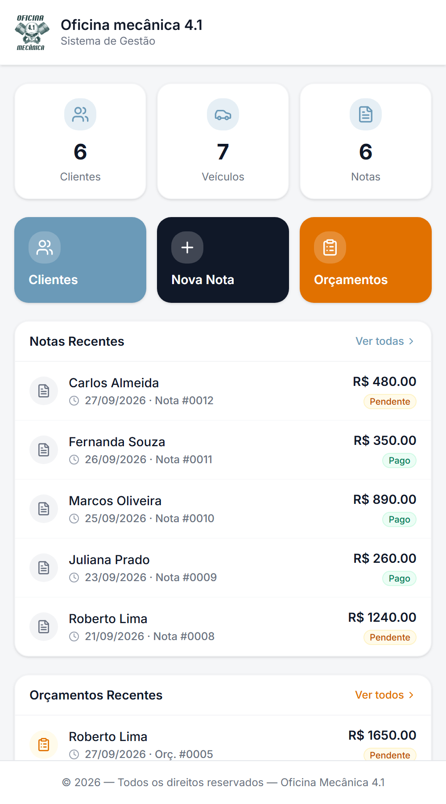
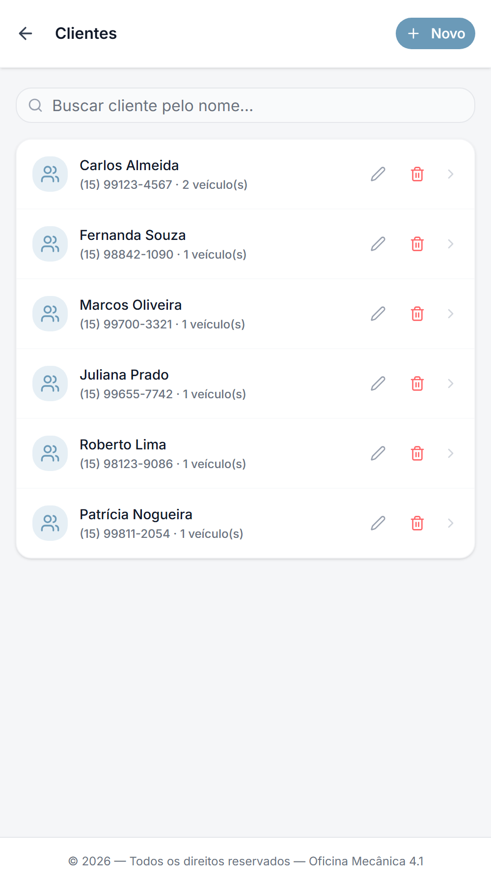
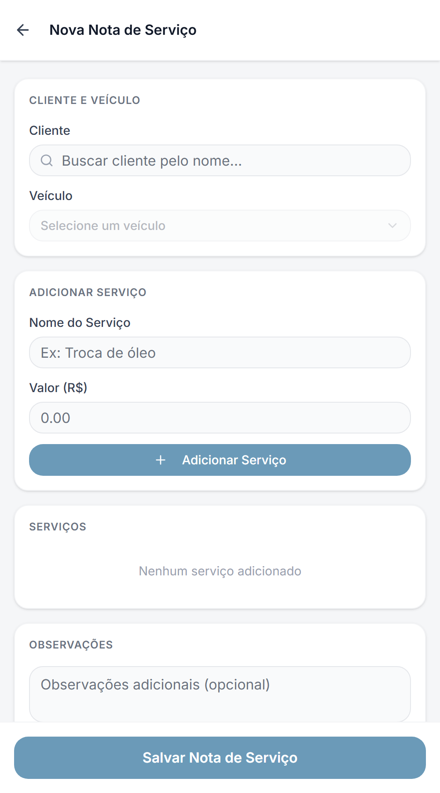
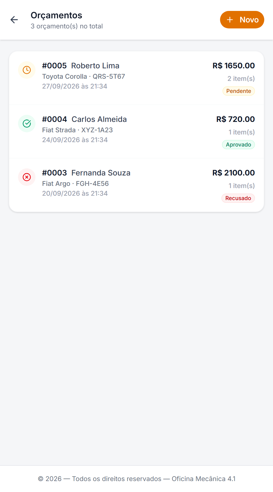

<div align="center">


# Oficina 4.1

**Notas de serviço e orçamentos em PDF, direto do celular.**

Sistema de gestão para oficina mecânica, no formato PWA: cadastro de clientes e veículos, notas de serviço, orçamentos e envio do PDF pelo WhatsApp — com os dados sincronizados em tempo real entre os aparelhos.

<br />

[](https://oficina-4-1.vercel.app)

<br />


</div>

<br />

## Sobre o projeto

A **Oficina 4.1** nasceu de um problema comum em oficinas pequenas: notas e orçamentos feitos à mão ou em planilhas, difíceis de achar depois e demorados para mandar ao cliente.

O sistema junta tudo em um app que abre direto no celular. O mecânico cadastra o cliente e o veículo, monta a **nota de serviço** ou o **orçamento** com os serviços e valores, gera um **PDF com a logo da oficina** e envia para o cliente pelo **WhatsApp** em um toque. Como os dados ficam no Firestore, o que é lançado em um aparelho aparece nos outros na hora.

> Projeto desenvolvido sob medida para uma oficina mecânica real. As telas abaixo usam **dados fictícios**.

<br />

## Telas

<div align="center">

<table>
  <tr>
    <td align="center"><br /><sub><b>Início</b></sub></td>
    <td align="center"><br /><sub><b>Clientes e veículos</b></sub></td>
  </tr>
  <tr>
    <td align="center"><br /><sub><b>Nova nota de serviço</b></sub></td>
    <td align="center"><br /><sub><b>Orçamentos</b></sub></td>
  </tr>
</table>

</div>

<br />

## Funcionalidades

- 📊 **Início** — visão geral com o total de clientes, veículos e notas, atalhos rápidos e listas de notas e orçamentos recentes.
- 👥 **Clientes e veículos** — cadastro completo, vários veículos por cliente e busca pelo nome.
- 🧾 **Notas de serviço** — criar, editar, excluir e marcar como **pendente** ou **paga**, com numeração automática.
- 📝 **Orçamentos** — mesmo fluxo das notas, com status **pendente**, **aprovado** ou **recusado**.
- 📄 **PDF com a logo** — nota e orçamento exportados em PDF formatado, prontos para o cliente.
- 💬 **Envio pelo WhatsApp** — abre a conversa com a mensagem pronta e o PDF para anexar (ou compartilha o arquivo direto, quando o aparelho permite).
- 🔄 **Tempo real** — os dados sincronizam entre os aparelhos pelo Firestore.
- 📱 **PWA instalável** — funciona como app na tela inicial, com ícone próprio e atualização automática.

<br />

## Tecnologias

| Camada | Stack |
|--------|-------|
| **Linguagem** | TypeScript (modo estrito) |
| **UI** | React 18 · Tailwind CSS 4 · shadcn/ui (Radix) · Lucide · Sonner |
| **Build** | Vite 6 |
| **Banco de dados** | Firebase Firestore (sincronização em tempo real) |
| **PDF** | jsPDF |
| **PWA** | vite-plugin-pwa (Workbox) |
| **Hospedagem** | Vercel |

<br />

## Arquitetura

O app é 100% front-end. A navegação é feita por estado (sem React Router) e um `DataContext` concentra os dados, que chegam do Firestore por listeners em tempo real.

```
src/
├── app/
│   ├── components/      # Telas (Dashboard, Clientes, NovaNota, NotaView, Orçamentos…)
│   │   └── ui/          # Componentes shadcn/ui em uso
│   ├── context/         # DataContext — estado global sincronizado com o Firestore
│   ├── services/        # dbService — leitura, escrita e listeners do Firestore
│   ├── utils/           # Geração dos PDFs (nota e orçamento)
│   └── types.ts         # Cliente, Veiculo, NotaServico, Orcamento
├── lib/                 # Configuração do Firebase
├── assets/              # Logo da oficina
└── styles/              # Tema e CSS global
```

Cada coleção do Firestore (`clientes`, `veiculos`, `notas`, `orcamentos`) tem um listener em tempo real, e o `DataContext` só repassa o resultado para as telas:

```ts
export function subscribeNotas(cb: (data: NotaServico[]) => void): Unsubscribe {
  return onSnapshot(collection(getDb(), 'notas'), snap => {
    cb(snap.docs.map(d => ({ id: d.id, ...d.data() } as NotaServico)));
  });
}
```

<br />

## Como rodar localmente

> O projeto usa Firebase, então precisa das suas próprias credenciais para funcionar.

```bash
# 1. Clone o repositório
git clone https://github.com/Danyyks/oficina-4.1.git
cd oficina-4.1

# 2. Instale as dependências
npm install
```

3. Crie um projeto no [Firebase](https://console.firebase.google.com/) e ative o **Cloud Firestore**.
4. Crie o arquivo `.env.local` na raiz com as chaves do seu app web (ele já é ignorado pelo Git):

```bash
VITE_FIREBASE_API_KEY=
VITE_FIREBASE_AUTH_DOMAIN=
VITE_FIREBASE_PROJECT_ID=
VITE_FIREBASE_STORAGE_BUCKET=
VITE_FIREBASE_MESSAGING_SENDER_ID=
VITE_FIREBASE_APP_ID=
```

5. Rode o app:

```bash
npm run dev
```

A aplicação abre em `http://localhost:5173`. Para gerar a versão de produção, use `npm run build`.

<br />

## Roadmap

- [x] Cadastro de clientes e veículos.
- [x] Notas de serviço e orçamentos com PDF.
- [x] Sincronização em tempo real com o Firestore.
- [x] PWA instalável.
- [ ] Login para proteger o acesso aos dados.
- [ ] Relatório mensal de faturamento.

<br />

## Autor

Feito por **Dany Jonathan Bueno** — estudante de Análise e Desenvolvimento de Sistemas e desenvolvedor em formação.

[](https://linkedin.com/in/danyyjonathan)
[](https://instagram.com/danyyjonathan)
[](https://mail.google.com/mail/?view=cm&fs=1&to=danyy.jonathan@gmail.com)

<br />

<div align="center">
<sub>Oficina 4.1 · PWA de gestão para oficina mecânica · React + TypeScript + Firebase</sub>
</div>
